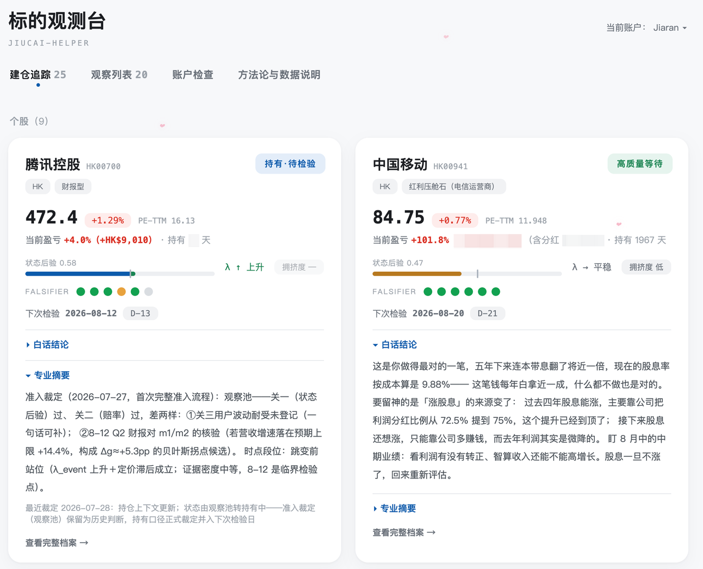

# jiucai-helper · 个人投资决策治理系统

[](https://img.shields.io/badge/AI-Skill-111111?style=flat-square) [](https://img.shields.io/badge/Decision-Governance-2563EB?style=flat-square) [](https://img.shields.io/badge/Bayesian%20×%20Poisson-D97706?style=flat-square) [](https://img.shields.io/badge/Claude%20Code-Supported-6B5B95?style=flat-square) [](https://img.shields.io/badge/WeChat-evadebot-07C160?style=flat-square&logo=wechat&logoColor=white) [](https://img.shields.io/badge/%E5%85%AC%E4%BC%97%E5%8F%B7-%E5%98%89%E7%84%B6%E5%AD%A6%E4%B9%A0%E7%AC%94%E8%AE%B0-07C160?style=flat-square&logo=wechat&logoColor=white) [](https://x.com/_jiaran) [](https://github.com/Jiaranbb)

[30 秒开始](#30-秒开始) · [方法论全解](https://my.feishu.cn/wiki/HkMzwgtNqiSv1ekE9sZcZUtmnih?from=from_copylink) · [数据回测](#数据回测) · [问题反馈](https://github.com/Jiaranbb/jiucai-helper/issues) · [联系作者](#作者与反馈)

**作者／联系方式**：嘉然 Jiaran · 公众号：**嘉然学习笔记** · 微信：`evadebot` · X：[@_jiaran](https://x.com/_jiaran)

`jiucai-helper` 是一个面向个人投资者的决策治理 AI Skill。核心方法论蒸馏自公众号「贝叶斯之美」388 篇公开语料，转译为个股散户形态后，用 A股 1090 只科技股做了独立复现验证。

> 它不告诉你买什么。管的是买入前后的三个问题：能不能进、还能不能拿、什么时候必须认错。

## 核心理念

这套系统建立在一个前提上：**投资归根结底是算概率**。没人能永远预测对，但可以用贝叶斯框架把已知证据算进决策，用泊松模型管住持有过程中的噪音和情绪。先活下去，让概率慢慢偏向自己。

从这个前提出发：

- 公司好不好，看证据，不看你的成本价，不看跌了多久「该反弹了」；
- 每个标的准入时预注册证伪条件，条件触发就重新裁定，不事后换理由；
- 泊松过程没有记忆——跌久了不等于要涨，涨久了不等于要跌；
- 你的承受力是准入三关之一，过不了就不进，不管公司多好。

不认可这个前提，后面的一切对你都没意义。

## 不荐股、不预测涨跌、不自动交易、不承诺收益

这四条写进了系统硬约束。本 Skill 不会输出「建议买入」「该卖了」「目标价」一类买卖建议，所有产出都是「框架条件状态的研究裁定」，买卖决定始终在你自己手里。

## 30 秒开始

把下面这段话直接发给 Codex、Claude Code、OpenClaw 或其他支持 Skill 的 Agent：

```text
请从 GitHub 安装 jiucai-helper skill：https://github.com/Jiaranbb/jiucai-helper。安装完成后提醒我按当前工具要求重启或刷新 Agent。
```

如果你的环境支持 `skills` CLI，也可以尝试：

```bash
npx skills add https://github.com/Jiaranbb/jiucai-helper --skill jiucai-helper
```

Codex 用户也可以手动安装：

```bash
python3 ~/.codex/skills/.system/skill-installer/scripts/install-skill-from-github.py \
  --repo Jiaranbb/jiucai-helper \
  --path . \
  --name jiucai-helper
```

安装完成后，按当前工具要求重启或刷新 Agent，让新 Skill 生效。

### 首次配置

第一次调用时，`jiucai-helper` 会逐步引导你完成：

1. 选择本地档案目录；
2. 检查 Python 3.9 或更高版本；
3. 在独立虚拟环境中安装 `akshare` 与 `baostock` 免费行情组件；
4. 选择是否配置 Futu OpenAPI；
5. 实际验证行情通道并启动本地观测台。

有富途账号时，可以免费申请 OpenAPI 权限并连接 OpenD，获得更及时、字段更完整的行情。没有富途也可以使用：A股走免费行情源，港股使用延迟快照兜底，但关键价格仍应人工复核。

如需手动检查或启动：

```bash
bash scripts/bootstrap.sh --check
bash scripts/bootstrap.sh --yes
bash scripts/bootstrap.sh --launch
```

浏览器打开 `http://127.0.0.1:8787/`。所有个人档案、持仓上下文和观测台数据均保存在本地，不会上传到本仓库或第三方服务。

### 安装后先做什么

1. 查看预设的「模拟账号」观测台；
2. 用持仓列表截图、CSV 或结构化文本初始化个人账户；
3. 试试「XX 现在还能买吗？」；
4. 试试「XXX 还能继续持有吗？」；
5. 阅读[《jiucai-helper 方法论全解》](https://my.feishu.cn/wiki/HkMzwgtNqiSv1ekE9sZcZUtmnih?from=from_copylink)。

## 直接这样用

| 你说 | 它做 |
|------|------|
| X 现在还能买吗／准入 X／X 能不能买 | 新建档案，执行排雷、取证、贝叶斯更新、三关、时点裁定与 falsifier 预注册 |
| X 还能继续持有吗／更新 X／X 出财报了 | 执行持有裁定并更新档案 |
| 巡检 | 扫描全部在跟踪标的 |
| 换仓 X→Y | 比较同因子载体效率 |
| 仅登记 X | 轻量占位建档，不跑深研 |
| 退出复盘 X | 平仓复盘并更新方法后验 |
| 打开标的观测台 | 启动本地观测台并返回链接 |

## 它管什么

市面上的投资类工具通常在回答「买什么」。`jiucai-helper` 管的是你已经产生投资想法之后的决策过程。

**能不能进**：公司状态 × 价格赔率 × 你的承受力，三关缺一不可。排雷十项先过，过了才进入贝叶斯更新，更新完还要过时点裁定——公司再好，刚完成跳涨、价格已经充分反映预期，也进不了准入。

**还能不能拿**：事件驱动的持有裁定。没消息不等于逻辑坏了，有消息先分清是真跳变还是噪音。「跌久了该反弹」「等回本」是非法持有理由——泊松过程没有记忆，成本价不进入证据面。

**什么时候必须认错**：每个标的准入时预注册至少三条证伪条件，白纸黑字写下来，旧条件不得事后改写。条件触发后，系统按预先约定的规则降级或退出。

## 两问两模型

| 阶段 | 核心问题 | 模型 | 输出 |
|------|----------|------|------|
| 买入前 | 能不能买、是不是时候 | 贝叶斯筛选＋泊松时点裁定 | 准入条件满足／观察池／不满足 |
| 买入后 | 还能不能拿 | 泊松事件管理与风控 | 高质量等待／降级观察／退出条件已触发 |

买入前的完整链路：排雷十项 → 状态迁移假设 H 与最强反方 ¬H → 先验 → 三路取证（财务／产业链／竞品叙事）→ 后验更新 → 三关 → 时点裁定 → 预注册 falsifier。

买入后只问四件事：事件强度升了吗、证据变密了吗、状态迁移还在推进吗、定价还滞后吗。

## 效果预览



> 标的观测台真实使用界面；账户金额与敏感持仓信息已经遮挡。

安装包内置一个完全脱敏的「模拟账号」，默认包含中国移动、贵州茅台、红利ETF易方达、红利低波100ETF博时、光迅科技与腾讯控股，安装后无需录入私人数据即可查看完整界面。

- **档案库**：每个标的一份 Markdown 活档案，作为唯一事实源，包含证据台账、falsifier 看板与裁定卡历史。每个数字必须带来源与日期，取不到就写「证据不足」。
- **本地观测台**：前端与服务均在本地运行，只读解析档案库。标的卡片包含状态后验、λ 事件强度、falsifier 灯排、下次检验日及白话结论。
- **三线深研**：公司与财务线、产业链与上下游线、竞品与叙事线同时取证，避免只围绕单一故事找材料。

## 方法论来源

- **语料**：公众号「贝叶斯之美」388 篇公开文章（2023-04 至今）。骨干文章包括[《AI投资的贝叶斯闭环》](https://mp.weixin.qq.com/s/uYjzx6hPvhHnXybzJ2VDOA)、[《投资是泊松过程》](https://mp.weixin.qq.com/s/pDGfj6V4zZGVho96aO3PIA)等六篇，概念冲突时以原文为准。
- **转译**：原方法论是机构组合视角。个人不能无限补仓，资金进出是真实约束，成本价只进入承受力而不进入证据面；这些是转译时补上的约束。
- **公司取证**：准入流程中的排雷、财务、产业链与竞品叙事研究，吸收了 [report-helper](https://github.com/Jiaranbb/report-helper) 的成熟工作流。
- **完整说明**：[《jiucai-helper 方法论全解》](https://my.feishu.cn/wiki/HkMzwgtNqiSv1ekE9sZcZUtmnih?from=from_copylink)，已设置为免登录阅读。

## 数据回测

核心判据「营收增速正拐点」来自公众号「贝叶斯之美」作者的回测：全球约 300 家科技股（2010〜2024），正拐点后 12 个月平均超额约 +32pp。原文：[《科技股投资没有中间态与贝叶斯拐点》](https://mp.weixin.qq.com/s/BUen5mWNdiMOer4RyxgovA)。

我用 A股数据做了独立复现，完整口径、限制与解释收录在[《jiucai-helper 方法论全解》](https://my.feishu.cn/wiki/HkMzwgtNqiSv1ekE9sZcZUtmnih?from=from_copylink)的数据验证章节中。

| 指标 | 正拐点组 | 负拐点组 | 组间差 |
|------|----------|----------|--------|
| 平均超额（12 个月） | +18.8pp | +12.2pp | +6.6pp |
| 中位超额 | +4.8pp | +1.0pp | +3.8pp |
| 胜率 | 54.7% | 51.3% | +3.4pp |

样本：1090 只科技股、69 个季度、9742 个信号事件，财报公告日入场，含负拐点对照组。

方向确认了：正拐点组在所有期限、所有口径上稳定优于负拐点组。但信号自身的增量只有约 4〜7pp——+18.8pp 的大头是科技小盘股相对沪深 300 的系统性贝塔与幸存者偏差（对照组也有 +12.2pp）。收益呈幂律右尾，中位数只有 +4.8pp，均值被极少数大涨股拉高。拐点判据是方向性加分项，不是独立的准入驱动力。另一个发现：负拐点在 A股不构成独立退出依据（对照组未被系统性惩罚），须与其他退出信号并用。

有效性分三层：「流程能减少经典错误」有依据，「信号有历史数据支持」有依据，「整套系统能稳定产生超额」仍在验证中。三个命题不混为一谈。

## 韭菜行为护栏

| 经典行为 | 系统护栏 |
|----------|----------|
| 跌久了觉得该反弹 | 赌徒谬误不进入裁定，只查事件强度与证据斜率 |
| 被套等回本 | 成本价隔离在证据面之外，只进入个人承受力 |
| 新闻刷屏当利好 | 同源报道合并，十篇转述只算一条证据 |
| 赚的早早卖、亏的死死扛 | 卖出只看证据恶化与机会成本，不看盈亏颜色 |
| 下跌后不断换理由 | falsifier 事前注册，旧条件不可事后改写 |
| 好公司不看价格直接买 | 反推现价已经隐含的增长与市场预期 |

完整版见[《jiucai-helper 方法论全解》](https://my.feishu.cn/wiki/HkMzwgtNqiSv1ekE9sZcZUtmnih?from=from_copylink)。

## 搭配 report-helper

`jiucai-helper` 的准入流程包含公司层面的取证，这部分工作流吸收了 [report-helper](https://github.com/Jiaranbb/report-helper)——我此前开源的深度研究报告 Skill。

两个 Skill 分工不同：

| | report-helper | jiucai-helper |
|---|---|---|
| 回答什么 | 这家公司什么情况 | 能不能进、能不能拿、什么时候认错 |
| 输出 | 可分享的 PDF 研究报告 | 裁定卡＋Markdown 活档案 |
| 适合 | 调研一家公司／行业／产业链 | 管理持仓和决策纪律 |

先用 report-helper 跑一遍公司调研，再用 `jiucai-helper` 做准入裁定，公司层面的证据会更扎实。但两个 Skill 各自独立，不安装 report-helper 也能正常使用 `jiucai-helper`。

## 适合／不适合

**适合**

- 投资理念成熟、偏长期持有（数月到数年）、风险偏好保守的个人投资者；
- 有季度经营数据、有可验证事件路径的标的；
- 想给自己的决策过程增加纪律的人。

**不适合**

- 日内短线、纯技术图形、完全被动的指数定投；
- 没有可核验信息的故事型标的；
- 想要「一键买入」或自动交易的人。

## 公开记分板

[模拟账号记分板](demo/%E6%A8%A1%E6%8B%9F%E8%B4%A6%E5%8F%B7/_Method_Log.md)保存预注册检验点与裁定追踪记录。每张裁定卡都是带日期的可检验预测，框架本身也是待检验假设。

## 深入阅读

- [方法论全解](https://my.feishu.cn/wiki/HkMzwgtNqiSv1ekE9sZcZUtmnih?from=from_copylink)——完整手册：概念、参数、边界与不做什么；
- [模拟账号记分板](demo/%E6%A8%A1%E6%8B%9F%E8%B4%A6%E5%8F%B7/_Method_Log.md)——预注册检验点与裁定追踪；
- [report-helper](https://github.com/Jiaranbb/report-helper)——深度公司调研报告 Skill；
- [`references/`](references/)——方法论内核、准入与持有工作流、档案模板、取证规范。

## 常见问题

**这和选股软件／量化交易有什么区别？**

选股软件回答「买什么」，量化交易回答「怎么自动买卖」。`jiucai-helper` 管的是已经有投资想法之后的决策流程：排雷、取证、贝叶斯更新、时点裁定、持有裁定与认错退出。它是决策纪律工具，不是交易工具。

**方法论是你自己发明的吗？**

不是。核心方法论蒸馏自公众号「贝叶斯之美」388 篇公开语料。我做的是转译（机构视角 → 散户个股形态）与独立验证（A股数据复现）。

**可以用来做短线吗？**

不适合。系统按季度经营数据和事件驱动设计，最短持有周期也以月为单位。日内交易、技术图形不在它的能力范围内。

**需要付费行情数据吗？**

不需要。Futu OpenAPI 是可选行情源；没有 Futu 时，A股使用 `akshare` 或 `baostock` 免费源，港股使用延迟快照兜底。免费源的实时性、稳定性和准确性不作保证，关键价格应人工复核。

**不安装 report-helper 能用吗？**

能。两个 Skill 各自独立。`jiucai-helper` 自带公司取证流程，只是这部分工作流的底子来自 report-helper。如果你需要完整、可分享的 PDF 调研报告，再安装 report-helper。

**所有数据都会上传吗？**

不会。个人档案、持仓、成本、盈亏和观测台数据都只保存在用户选择的本地目录。公开仓库只包含脱敏模拟账号与公开研究样本。

## 作者与反馈

**嘉然 Jiaran**

- 公众号：**嘉然学习笔记**；
- 微信：`evadebot`；
- X：[@_jiaran](https://x.com/_jiaran)；
- GitHub：[Jiaranbb](https://github.com/Jiaranbb)；
- 问题与建议：[GitHub Issues](https://github.com/Jiaranbb/jiucai-helper/issues)。

## 免责声明

本项目所有输出为研究与决策流程工具，不构成投资建议、不构成任何买卖指令。投资有风险，历史数据与回测不代表未来收益，全部决策及其后果由使用者自行承担。

## License

MIT License。详见 [LICENSE](LICENSE)。
